# YOLO使用心得文档

## VOC 2007数据集的训练和检测

### 环境搭建

下载源码并配置Python虚拟环境，并对应`requirements.txt`安装必要的库。

### 数据集准备

下载并解压VOC 2007数据集。

将VOC数据格式转为YOLO格式。

划分训练集和验证集。

### YOLO v5和YOLO v9模型训练

修改数据配置文件

```yaml
path: D:/Code/VOC_2007/VOCdevkit
train: # train images 
  - images/train
val: # val images
  - images/val

# Classes
names:
  0: aeroplane
  1: bicycle
  2: bird
  3: boat
  4: bottle
  5: bus
  6: car
  7: cat
  8: chair
  9: cow
  10: diningtable
  11: dog
  12: horse
  13: motorbike
  14: person
  15: pottedplant
  16: sheep
  17: sofa
  18: train
  19: tvmonitor

```

利用预训练权重进行训练。同时修改模型配置文件中的类别数为20.

通过指定数据集配置文件、图像尺寸、批次大小和训练周期等参数，可以启动训练过程。

```bash
python train.py --data voc_2007.yaml --epochs 50 --weights 'yolov5s.pt' --cfg 'models/yolov5s_voc.yaml'  
```

在训练过程中，使用tensorboard监测各个指标的变化。

```bash
tensorboard --logdir=runs\train
```

YOLOv9的训练过程与YOLOv5类似，但需要根据模型的具体要求调整参数和配置文件。

```bash
python train_dual.py --data voc_2007.yaml --epochs 50 --weights 'yolov9-c.pt' --cfg 'models/yolov9_voc.yaml' --hyp 'data/hyps/hyp.scratch-high.yaml'
```

### 训练结果与模型评估

YOLO v5

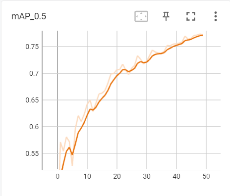

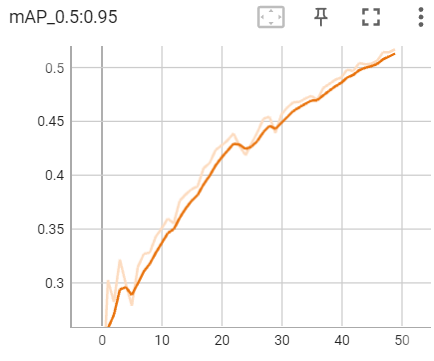

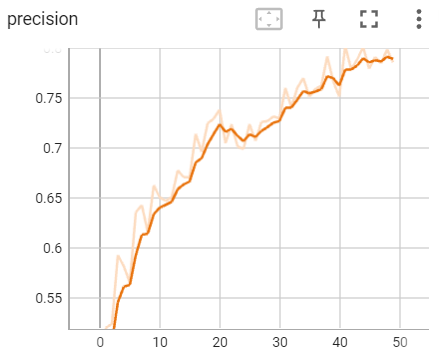

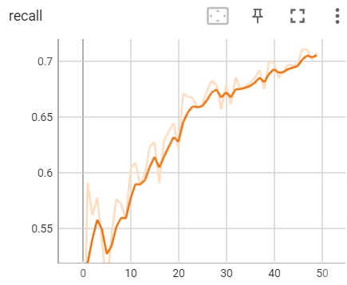

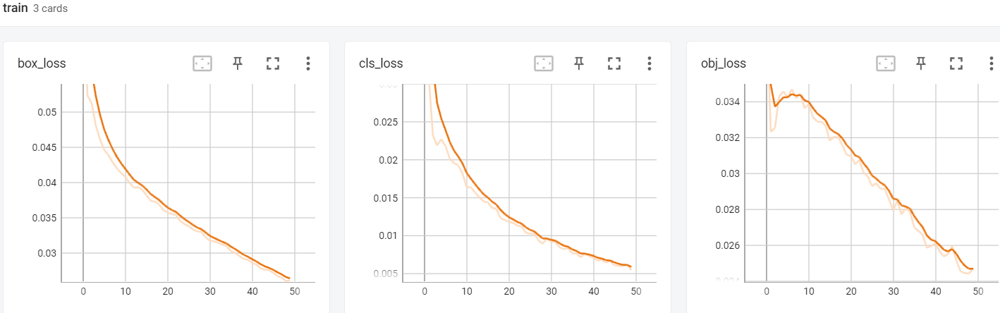

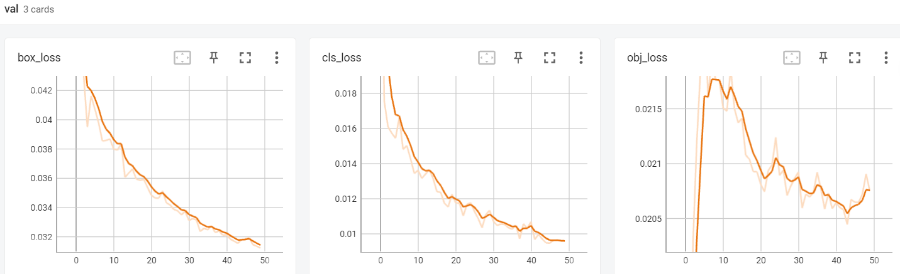


YOLO v9

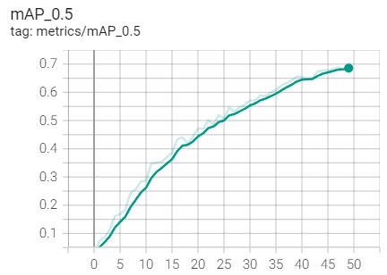

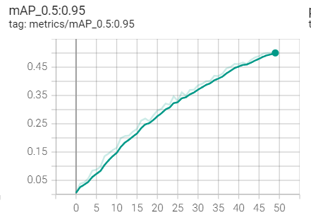

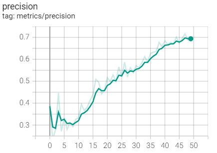

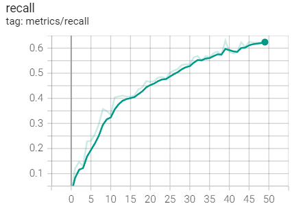

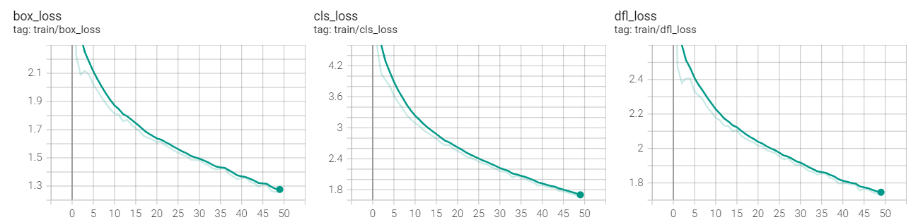


### 模型检测

使用已有模型和训练后得到的模型进行目标检测

检测结果如下：

YOLO v5

```bash
python detect.py --weights 'best.pt' --source 'data/images' --data 'data/voc_2007.yaml'
```


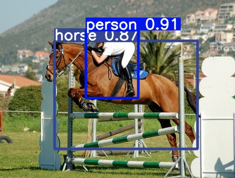

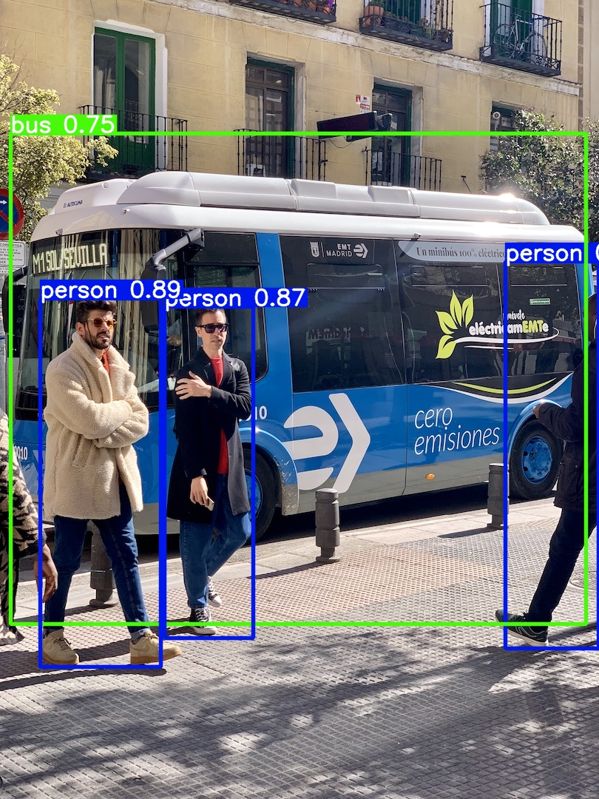

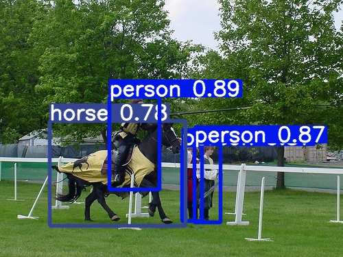

YOLO v9

```bash
python detect.py --weights 'best.pt' --source 'data/images' --data 'data/voc_2007.yaml'
```


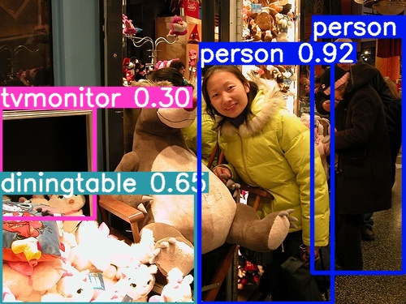

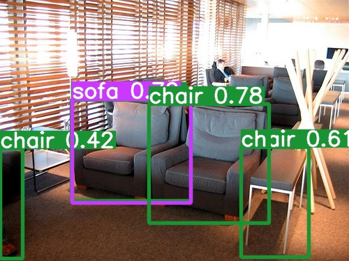

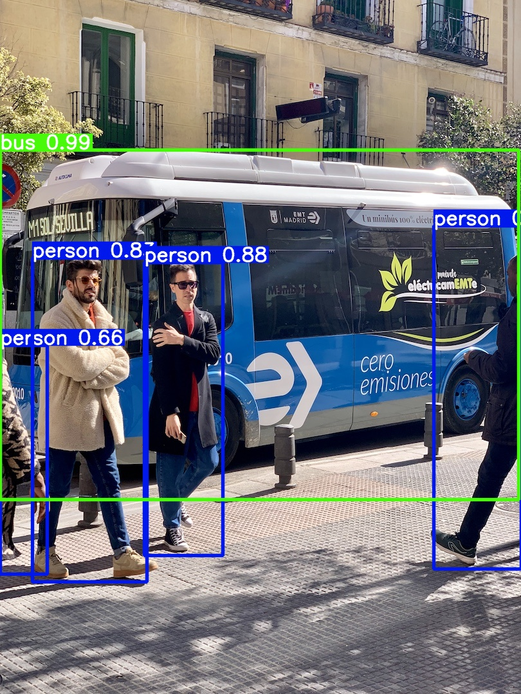


### 心得体会

1. **数据集标注**：不同的数据集标注格式不同，在使用YOLO进行训练时需要将格式转化为YOLO格式。

2. **预训练权重的作用**：使用预训练权重可以显著提高训练效率和模型性能，尤其是在数据量有限的情况下。

3. **库的版本问题**：不同版本的库之间存在区别，可能在版本更新后部分函数发生变化，导致报错。同时在库与库之间可能存在版本不兼容问题，如遇到的opencv-python与numpy之间的问题。

   