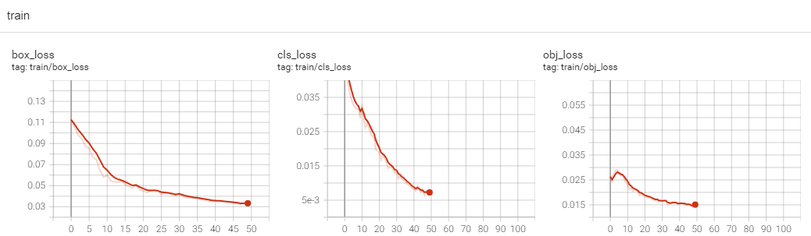
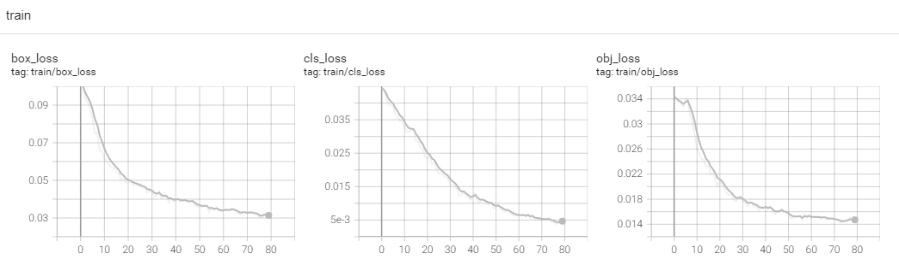

# 北大PCB数据集的训练和检测

## 训练与检测

### 1. 训练模型

**步骤概述:**

1. **准备数据**:

   - 使用北大PCB数据集，标注为voc格式，需要转为yolo格式，整理文件结构并划分训练集，验证集和测试集（`xml2yolo.py`，`divide.py`）
   - 修改数据配置文件(`PCB.yaml`)

2. **配置训练参数**:

   - 修改模型配置文件（ `yolov5s_pcb.yaml`）

3. **修改网络结构：**

   * PCB缺陷检测涉及到从复杂的背景中识别出微小的缺陷，这要求模型能够捕捉到细微的视觉特征。考虑引入注意力机制提高检测精度。

   * 在骨干网络中新增SE模块，以及将部分C3模块改为CBAMC3模块。通过增加两种不同的注意力机制模块提升模型的特征表达能力和模型的识别能力

     * SE模块的作用是通过学习通道间的依赖关系来提高网络的表达能力。它通过全局平均池化来获取每个通道的全局信息，然后通过两个全连接层来学习通道的重要性权重，最后通过Sigmoid激活函数生成每个通道的权重。这些权重与原始特征图进行逐元素相乘，从而强化重要的特征并抑制不重要的特征。
     * CBAMC3集成了通道和空间注意力机制，可以显著提升模型对于关键特征的捕捉能力，从而提高检测任务的性能。

     ```yaml
     # YOLOv5 v6.0 backbone+CBAMC3+SE
     backbone:
       # [from, number, module, args]
       [[-1, 1, Conv, [64, 6, 2, 2]],  # 0-P1/2
        [-1, 1, Conv, [128, 3, 2]],  # 1-P2/4
        [-1, 3, C3, [128]],
        [-1, 1, Conv, [256, 3, 2]],  # 3-P3/8
        [-1, 6, C3, [256]],
        [-1, 1, Conv, [512, 3, 2]],  # 5-P4/16
        [-1, 9, C3, [512]],
        [-1, 1, Conv, [1024, 3, 2]],  # 7-P5/32
        [-1, 3, CBAMC3, [1024]], # CBAMC3：集成了CBAM的C3模块
        [-1, 1, SE, [1024]], # SE
        [-1, 1, SPPF, [1024, 5]],  # 10
       ]
     ```

   * 代码修改`models/common.py`和`models/yolo.py`

     * 定义SE模块

     ```python
     class SE(nn.Module):
         def __init__(self, c1, c2, ratio=16):
             super(SE, self).__init__()
             # SE模块的初始化方法
             # c1: SE模块输入的通道数
             # c2: SE模块输出的通道数
             # ratio: 压缩比，用于定义全连接层的维度
             
             # 全局平均池化层，将特征图的每个通道压缩成一个数值
             self.avgpool = nn.AdaptiveAvgPool2d(1)
             
             # 第一个全连接层，用于降维
             # c1 // ratio 表示降维后的通道数
             self.l1 = nn.Linear(c1, c1 // ratio, bias=False)
             
             # ReLU激活函数
             self.relu = nn.ReLU(inplace=True)
             
             # 第二个全连接层，用于恢复原来的维度
             self.l2 = nn.Linear(c1 // ratio, c1, bias=False)
           
             # Sigmoid激活函数，用于生成每个通道的权重
           self.sig = nn.Sigmoid()
     
         def forward(self, x):
             # SE模块的前向传播方法
             # x: 输入的特征图，维度为(b, c, h, w)，其中b是批次大小，c是通道数，h和w是特征图的高度和宽度
             
             # 获取输入特征图的批次大小和通道数
             b, c, _, _ = x.size()
             
             # 通过全局平均池化层，将每个通道的特征图压缩成一个数值
             y = self.avgpool(x).view(b, c)
             
             # 通过第一个全连接层降维
             y = self.l1(y)
             
             # 通过ReLU激活函数
             y = self.relu(y)
             
             # 通过第二个全连接层恢复原来的维度
             y = self.l2(y)
             
             # 通过Sigmoid激活函数生成每个通道的权重
             y = self.sig(y)
             
             # 将权重调整为与输入特征图相同的维度，以便进行逐元素相乘
             y = y.view(b, c, 1, 1)
             
             # 将权重与输入特征图进行逐元素相乘，重新校准特征图的通道响应
             return x * y.expand_as(x)
     ```
     
     * CBAMC3模块
     
     ```python
     # 通道注意力
     class ChannelAttention(nn.Module):
         def __init__(self, in_planes, ratio=16):
             super(ChannelAttention, self).__init__()
             self.avg_pool = nn.AdaptiveAvgPool2d(1)  # 全局平均池化
             self.max_pool = nn.AdaptiveMaxPool2d(1)  # 全局最大池化
     
             # 两个卷积层用于降低和恢复通道维度，实现通道注意力机制
             self.f1 = nn.Conv2d(in_planes, in_planes // ratio, 1, bias=False)  # 降维
             self.relu = nn.ReLU()  # ReLU激活函数
             self.f2 = nn.Conv2d(in_planes // ratio, in_planes, 1, bias=False)  # 恢复维度
             self.sigmoid = nn.Sigmoid()  # Sigmoid激活函数
     
         def forward(self, x):
             # 全局平均和最大池化的特征图通过卷积层和激活函数处理
             avg_out = self.f2(self.relu(self.f1(self.avg_pool(x))))
             max_out = self.f2(self.relu(self.f1(self.max_pool(x))))
             # 将两种注意力特征图相加，再通过sigmoid激活函数，得到通道注意力权重
             out = self.sigmoid(avg_out + max_out)
             # 将权重乘以原始输入特征图，实现通道加权
             return torch.mul(x, out)
     
     
   # 空间注意力
     class SpatialAttention(nn.Module):
         def __init__(self, kernel_size=7):
             super(SpatialAttention, self).__init__()
             # 确保卷积核尺寸是3或7
             assert kernel_size in (3, 7), 'kernel size must be 3 or 7'
             padding = 3 if kernel_size == 7 else 1  # 计算padding
     
             # 用于空间注意力的卷积层
             self.conv = nn.Conv2d(2, 1, kernel_size, padding=padding, bias=False)
             self.sigmoid = nn.Sigmoid()  # Sigmoid激活函数
     
         def forward(self, x):
             # 计算平均和最大特征图
           avg_out = torch.mean(x, dim=1, keepdim=True)
             max_out, _ = torch.max(x, dim=1, keepdim=True)
             # 将平均和最大特征图拼接
             out = torch.cat([avg_out, max_out], dim=1)
             # 通过卷积层和sigmoid激活函数，得到空间注意力权重
             out = self.sigmoid(self.conv(out))
             # 将权重乘以原始输入特征图，实现空间加权
             return torch.mul(x, out)
     
     
     # 集成了通道注意力和空间注意力的CBAMC3模块
     class CBAMC3(nn.Module):
         # CSP Bottleneck with 3 convolutions
         def __init__(self, c1, c2, n=1, shortcut=True, g=1, e=0.5):  # ch_in, ch_out, number, shortcut, groups, expansion
             super(CBAMC3, self).__init__()
             c_ = int(c2 * e)  # hidden channels
     
             # 定义CBAMC3模块中的卷积操作
             self.cv1 = Conv(c1, c_, 1, 1)
             self.cv2 = Conv(c1, c_, 1, 1)
             self.cv3 = Conv(2 * c_, c2, 1)
             # 定义CBAMC3模块中的瓶颈模块
             self.m = nn.Sequential(*[Bottleneck(c_, c_, shortcut, g, e=1.0) for _ in range(n)])
             # 定义通道注意力和空间注意力模块
             self.channel_attention = ChannelAttention(c2, 16)
             self.spatial_attention = SpatialAttention(7)
     
         def forward(self, x):
             # 将输入特征图通过通道注意力和空间注意力模块进行特征增强
             return self.spatial_attention(
                 self.channel_attention(self.cv3(torch.cat((self.m(self.cv1(x)), self.cv2(x)), dim=1))))
     ```
     
     在`yolo.py`中新增`SE`和`CBAMC3`模块
     
     ```python
     if m in {
         Conv, GhostConv, Bottleneck, GhostBottleneck, SPP, SPPF, DWConv, MixConv2d, Focus, CrossConv,
         BottleneckCSP, C3, C3TR, C3SPP, C3Ghost, nn.ConvTranspose2d, DWConvTranspose2d, C3x, CBAMC3, SE}:
         c1, c2 = ch[f], args[0]
         if c2 != no:  # if not output
             c2 = make_divisible(c2 * gw, 8)
     
             args = [c1, c2, *args[1:]]
             if m in {BottleneckCSP, C3, C3TR, C3Ghost, C3x, CBAMC3}:
                 args.insert(2, n)  # number of repeats
                 n = 1
     ```
     
     

4. **训练模型**:

   - 使用命令行启动训练过程：

     ```bash
     python train.py --weights yolov5s.pt --cfg models/yolov5s.yaml --data data/PCB.yaml --hyp data/hyps/hyp.scratch.yaml --epochs 50 --batch-size 16 --imgsz 640
     ```

5. **保存和评估模型**:

   - 训练完成后，模型会自动保存在指定的目录中。
   - 使用验证集评估模型的性能，检查指标如精度、召回率等。

### 2. 检测模型

**步骤概述:**

1. **加载模型**
   
   * 加载训练好的模型权重(`best.pt`)
   
2. **准备输入数据**

3. **执行推理**

   * 使用命令行进行检测：

     ```bash
     python detect.py --weights 'best.pt' --source 'data/pcb_images' --data 'data/PCB.yaml'
     ```

4. **展示结果**

   - 可视化检测结果，结果保存在`runs/detect/exp`目录下。

## 实验结果

### 原始YOLO v5





### 网络结构改进后

增加训练轮数和调整网络结构





