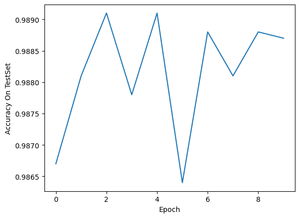
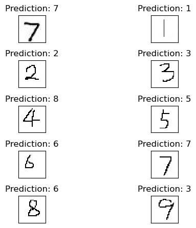
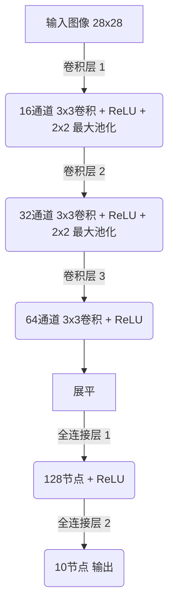
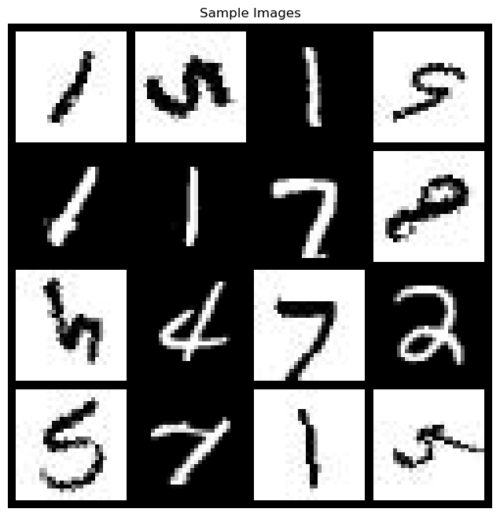

# 实验报告：手写数字识别

## 1. 实验目的
本实验使用卷积神经网络（CNN）模型在MNIST数据集及其扩充数据集上进行训练和测试，以达到高准确率的识别效果。

## 2. 数据集

### 2.1 MNIST数据集

- 包含60,000张训练图像和10,000张测试图像。
- 图像为28x28像素的手写数字灰度图。

### 2.2 数据集扩充
- 通过图像增强技术，包括反转和旋转，扩充了训练数据集。
- 扩充数据集用于提高模型的泛化能力和鲁棒性。

## 3. 方法
### 3.1 数据预处理
- 图像转换为灰度格式。

### 3.2 数据增强
- **反转图像**：将图像颜色反转，增加模型对光照变化的鲁棒性。
- **旋转图像**：随机旋转图像，增强模型对数字方向变化的识别能力。

### 3.3 网络架构
本实验采用的网络架构是一个简单的卷积神经网络，包含两个主要部分：卷积层和全连接层。

#### 3.3.1 卷积层
- **第一层**：1个输入通道，16个输出通道，卷积核大小为3x3，使用ReLU激活函数，后接2x2最大池化。
- **第二层**：16个输入通道，32个输出通道，卷积核大小为3x3，使用ReLU激活函数，后接2x2最大池化。
- **第三层**：32个输入通道，64个输出通道，卷积核大小为3x3，使用ReLU激活函数。

#### 3.3.2 全连接层
- 首先将卷积层的输出展平。
- 第一个全连接层有128个节点，使用ReLU激活函数。
- 最后一个全连接层输出10个节点，对应10个数字类别。

### 3.4 训练和评估
- 使用交叉熵损失函数。
- 使用Adam优化器进行参数优化。

## 4. 实验结果
- **目标1**：在扩充数据集的测试集上达到50%准确率。

- **目标2**：在扩充数据集的测试集上达到95%准确率。

  

- **目标3**：能够识别自己手写的数字。（准确率不高）

  

## 5. 结论
通过实验，我们发现数据增强显著提高了模型的泛化能力。模型在训练集和测试集上都表现出了较高的准确率，证明了模型的有效性。

## 6. 网络原理图



## 7. 训练集样例
以下是训练集中的一些图像：



## 8. 模型文件和测试说明
- **模型文件**：训练好的模型保存在`./models/cnn_mnist.pth`。
- **测试命令**：使用以下命令在出题人测试集上进行测试：
  
  ```bash
  python predict.py path/to/image.png
  ```

